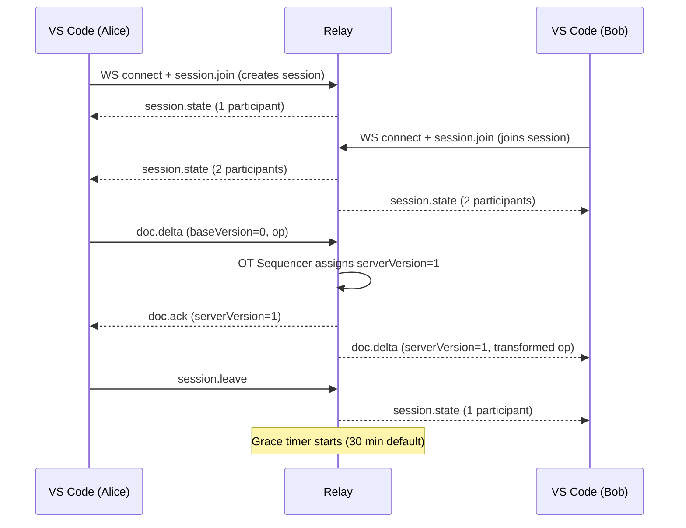

# CoVibes Architecture

## Components

```
┌──────────────────────────────────────────────────────┐
│  VS Code Instance A            VS Code Instance B     │
│  ┌────────────────┐            ┌────────────────┐     │
│  │ CoVibes Ext.   │            │ CoVibes Ext.   │     │
│  │ ┌────────────┐ │            │ ┌────────────┐ │     │
│  │ │ OT Engine  │ │            │ │ OT Engine  │ │     │
│  │ │ SessionMgr │ │            │ │ SessionMgr │ │     │
│  │ │ AgentCoord │ │            │ │ AgentCoord │ │     │
│  │ │ GitCoord   │ │            │ │ GitCoord   │ │     │
│  │ └────────────┘ │            │ └────────────┘ │     │
│  │    RelayClient ◄────────────► RelayClient    │     │
│  └────────┬───────┘            └───────┬────────┘     │
│           │ WSS                        │ WSS           │
└───────────┼────────────────────────────┼──────────────┘
            │                            │
            ▼                            ▼
     ┌──────────────────────────────────────┐
     │         CoVibes Relay (Fly.io)        │
     │  ┌──────────┐  ┌──────────────────┐  │
     │  │  Router  │  │  OT Sequencer    │  │
     │  │          │  │  (per-document)  │  │
     │  └──────────┘  └──────────────────┘  │
     │  ┌──────────────────────────────────┐ │
     │  │  SessionRegistry (Memory+Redis)   │ │
     │  └──────────────────────────────────┘ │
     └──────────────────────────────────────┘
                       │
                       ▼
               ┌──────────────┐
               │  Upstash Redis│
               │ (session meta)│
               └──────────────┘
```

## Packages

| Package              | Role                                                                                  |
| -------------------- | ------------------------------------------------------------------------------------- |
| `@covibes/protocol`  | Shared TypeScript types, zod message schemas, OT primitives, invite link format       |
| `@covibes/relay`     | Node.js WebSocket server; stateless message router + OT sequencer + session registry  |
| `@covibes/extension` | VS Code extension; OT client, session state machine, agent heuristic, git coordinator |

## Session Lifecycle



## OT Control Loop

Each client runs a Jupiter-style OT engine:

```
Local edit → compose into buffer
If pending empty → send buffer as pending, clear buffer

Remote op received:
  transform against pending + buffer
  apply transformed op to document

Ack received:
  clear pending
  if buffer non-empty → send buffer as new pending
```

The relay serializes all ops per `(sessionId, path)` via the OT Sequencer, assigning monotonically increasing `serverVersion` values. This guarantees all clients converge.

## Agent Activity Flow

```mermaid
sequenceDiagram
  participant A as Alice's extension
  participant R as Relay
  participant B as Bob's extension

  Note over A: Edit burst detected (heuristic or terminal)
  A->>R: agent.intent { path: "src/auth.ts" }
  R-->>B: agent.intent (forwarded)
  Note over B: Gutter marker shown; explorer badge set

  Note over A: Burst ends (2s quiet)
  A->>R: agent.change { path: "src/auth.ts" }
  R-->>B: agent.change (forwarded)
  Note over B: Check for overlap with own intent

  alt No overlap — auto-merge
    Note over A,B: Disjoint hunks merged silently; toast shown
  else Overlap — conflict UI
    A->>R: conflict.resolve { conflictId, resolvedText, confirmedBy }
    R-->>B: conflict.resolve
  end
```

## Relay Message Types

See [packages/protocol/src/messages/](../packages/protocol/src/messages/) for the full zod schemas.

| Type               | Flow                  | Purpose                                   |
| ------------------ | --------------------- | ----------------------------------------- |
| `session.join`     | Client→Server         | Join or create a session                  |
| `session.leave`    | Client→Server         | Leave a session                           |
| `session.state`    | Server→Client         | Full participant list                     |
| `doc.delta`        | Client→Server→Clients | OT op; relay sequences and transforms     |
| `doc.ack`          | Server→Client         | Op accepted; carries serverVersion        |
| `cursor.update`    | Client→Server→Clients | Cursor/selection position                 |
| `agent.intent`     | Client→Server→Clients | Agent starting work on a file             |
| `agent.change`     | Client→Server→Clients | Agent finished; triggers auto-merge check |
| `conflict.resolve` | Client→Server→Clients | Conflict resolved; apply result           |
| `git.operation`    | Client→Server→Clients | Commit/push/pull initiated                |
| `git.ack`          | Client→Server→Clients | Acknowledge a git operation               |
| `nav.file`         | Client→Server→Clients | User opened a different file              |
| `ping`/`pong`      | Both                  | Heartbeat                                 |
